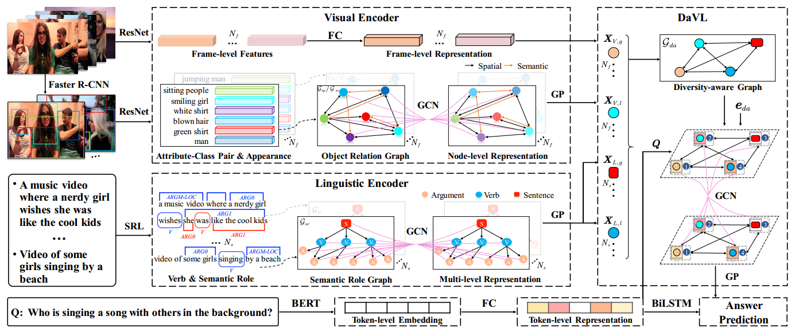
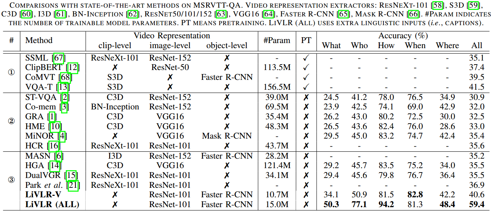
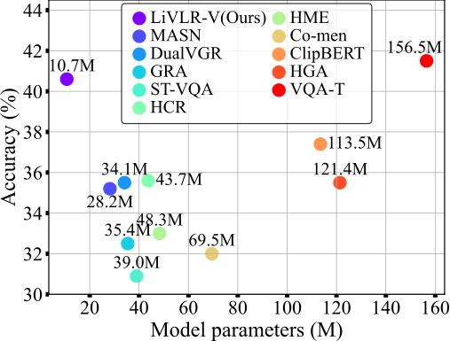

# LiVLR-VideoQA

We propose a Lightweight Visual-Linguistic Reasoning framework (LiVLR) for VideoQA. 
The overview of LiVLR:


## Evaluation on MSRVTT-QA 
### Dataset 
- Download pre-extracted visual and linguistic features from [here]().

### Results on MSRVTT-QA 
- Download pre-trained models from [here](). 

Comparison with SoTA       | Trainable parameters  
:-------------------------:|:-------------------------:
  |  


## Running the code 

### Install dependencies
```bash
conda create -n livlr_qa python=3.6
conda activate livlr_qa
conda install -c conda-forge ffmpeg
conda install -c conda-forge scikit-video
pip install -r requirements.txt
```

## Training
```bash
CUDA_VISIBLE_DEVICES=1,2 python train.py --exp_name Exp_DiVS/all 
```

## Evaluation
Setting the correct file path and run the following code:
```bash
python test.py
```
